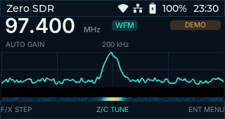

# Zero SDR for Cardputer Zero

[](https://github.com/k1412/cardputerzero-sdr/actions/workflows/ci.yml)
[](LICENSE)

Zero SDR is an open-source, keyboard-first RTL-SDR receiver for Cardputer Zero. The UI is rendered at the device's native 320×170 resolution and is designed around its physical `F/X/Z/C`, Enter, and Esc controls.



> [!IMPORTANT]
> This repository is a pre-release hardware bring-up project. The UI, deterministic offline demo, ten-language catalog, and desktop tests work. Live RTL-SDR capture, WFM audio, USB power behavior, and performance have **not** yet been verified on a physical Cardputer Zero, so no App Store release is claimed yet.

## Current status

- Native 320×170 spectrum and waterfall UI
- Deterministic demo centered on measured FM stations
- Cardputer key mapping with repeat-aware tuning
- Frequency clamp matching the tested FC0012 dongle: 22.0–948.6 MHz
- Six tuning steps from 10 kHz to 1 MHz
- Automatic/manual gain state, mute state, dark/light theme
- Ten UI languages: English, Simplified Chinese, Traditional Chinese, Spanish, Japanese, Korean, French, German, Brazilian Portuguese, and Russian
- Linux/macOS/Windows desktop simulator support inherited from the official CardputerZero template
- Unit tests for tuning boundaries, spectrum generation, and translation completeness

Not implemented or verified yet:

- RTL-SDR USB capture on Cardputer Zero
- WFM demodulation and speaker/headphone audio
- Persistence beyond theme selection
- ARM64 `.deb` installation on real hardware
- CardputerZero Store submission

## Controls

| Key | Radio screen | Settings screen |
| --- | --- | --- |
| `F` / Up | Larger tuning step | Previous row |
| `X` / Down | Smaller tuning step | Next row |
| `Z` / Left | Tune down | Previous value |
| `C` / Right | Tune up | Next value |
| Enter | Open settings | Return to radio |
| Esc | Exit to launcher | Return to radio |
| `G` | Toggle auto/manual gain | Toggle gain mode |
| `M` | Mute/unmute | Mute/unmute |
| `L` | Next language | Next language |
| `T` | Dark/light theme | Dark/light theme |

The bottom bar always shows the primary actions. Tuning keys support key repeat; destructive or hidden key chords are intentionally absent.

## Desktop build

Requirements: CMake 3.31+, Ninja, a C++17 compiler, SDL2, FreeType, libpng, libjpeg, and zlib. `fmt` 12.1.0 is fetched when a compatible system package is unavailable.

On Debian/Ubuntu:

```sh
sudo apt install build-essential cmake ninja-build libsdl2-dev \
  libfreetype-dev libpng-dev libjpeg-dev zlib1g-dev
cmake --preset linux-x86-64
cmake --build --preset linux-x86-64-dbg
ctest --test-dir build/linux-x86-64 -C Debug --output-on-failure
./build/linux-x86-64/Debug/cardputerzero-sdr
```

Headless screenshot smoke test:

```sh
SDL_VIDEODRIVER=dummy \
ZERO_SDR_LOCALE=zh-CN \
ZERO_SDR_START_PAGE=settings \
ZERO_SDR_SCREENSHOT=/tmp/zero-sdr.png \
ZERO_SDR_SCREENSHOT_EXIT=1 \
./build/linux-x86-64/Debug/cardputerzero-sdr
```

Run both pages in all ten locales with `scripts/smoke_locales.sh`.

## Cardputer Zero build

The cross preset follows the official CardputerZero CMake template and downloads its pinned BSP into `.cache/` when needed. An AArch64 cross compiler must be available.

```sh
cmake --workflow --preset cp0-cross-package
```

Expected package name: `dist/cardputerzero-sdr_0.1.0-1_arm64.deb`.

Do not treat a successful cross-build as device validation. Complete [the hardware test plan](docs/DEVICE_TEST_PLAN.md) before publishing a release.

## Project map

```text
src/app/       lifecycle, assets, simulator, screen switching
src/dsp/       deterministic spectrum source; live DSP will live here
src/i18n/      locale catalog and font selection
src/model/     bounded radio state
src/platform/  keyboard/evdev and future RTL-SDR/audio adapters
src/view/      LVGL screens, widgets, and 320×170 theme
src/viewmodel/ state formatting and UI actions
tests/         host-runnable unit tests
docs/          architecture, UX, language, and device validation guides
```

See [Architecture](docs/ARCHITECTURE.md), [UX and controls](docs/UX.md), [Internationalization](docs/I18N.md), and [Contributing](CONTRIBUTING.md).

## Store release policy

`app-builder.json` is prepared for the CardputerZero tooling, and all referenced screenshots are native 320×170 PNGs. Publication is held until the P0 hardware checks pass. The app does not install a root system service and does not require network or cloud access.

The package name is `cardputerzero-sdr`. An existing Store app named `zerosdr` is a separate project; this repository does not claim compatibility or ownership of it.

## License

Source code is MIT licensed. Bundled fonts and icon-font assets have their own notices under `assets/fonts/`. The generated Zero SDR app icon is contributed to this project under the repository's MIT license.
